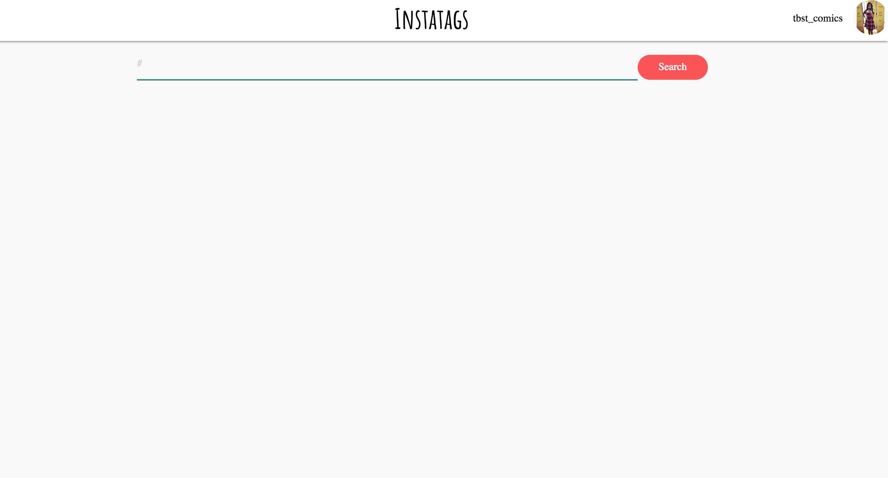
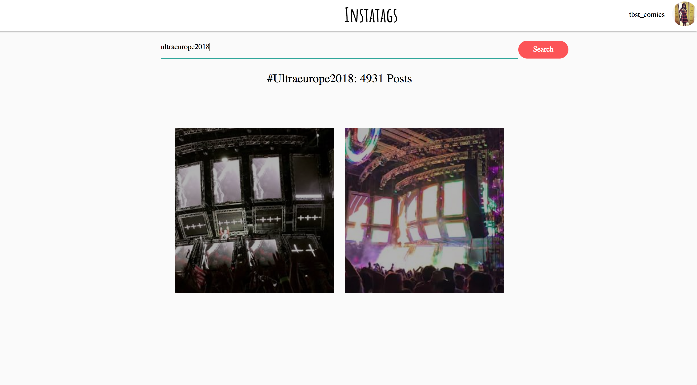

# Instatags
______________________________________________

## About the project : 

`Instatags` is a simple react application that uses the Instagram public API to show hashtag search results. 

- In order to use the API, the user is authorized using `oauth 2.0`
- The user can enter `tag` name to search for. 
- After clicking the `Search` button, the page will display the following:
    - Total count of images with the tags searched for.
    - The specific recent images of the authorized user, where the user has mentioned the searched tag name in their post.

## How to run the app?
- Git clone the repository
- Install dependencies using `npm install` or `yarn install`
- Run the development environment on `http://localhost:3000`

#### Setup Instagram configurations:

> When you want to start working with the Instagram API Platform, you can register a new app that will start in `Sandbox mode`. Since this mode is meant for development, `apps in Sandbox mode are not visible to the general public, but instead are only visible to a limited set of up to 10 authorized 'sandbox users'`. Only these users will be able to test and authenticate your app.
    
Two ways to use the application : 

-  First way:
     - Login from your instagram account and go to instagram developer site => https://www.instagram.com/developer

    - Register a new client to get a `Client Id`
        
    - Mention the `redirect URI`. It is important, since it redirects the user to your app's URL, once the user have permitted the app to use instagram auth flow.
        - Example: https://localhost:3000, https://instatagz.herokuapp.com
    
     - Inside the project folder, go to `src/config/keys.js`
        - Change the client id and redirect URI with the ones you have registered with your sandbox app on instagram developer platform.
      - Run the development server using `yarn start` and go to http://localhost:3000

- Second Way:

    - The project has been configured using my client Id, to make it visible for others, I can add limited set of up to 10 authorized `sandbox users`
    
    - After adding instagram `username` to the list, they will have to accept the invitation before actually becoming sandbox users. To accept the invitation, they can go to the `Sandbox Invites` button on the top bar of the developer site.
    
    - After becoming the authorized sandbox user, run the development server using `yarn start` and go to http://localhost:3000

____________________________________________________

## Work flow:

- The user clicks the `Login with instagram` button and is directed to instagram o-auth flow 
    > https://api.instagram.com/oauth/authorize/?client_id==CLIENT-ID&redirect_uri=REDIRECT-URI&response_type=token&scope=public_content

_____________________________________________________

- After authorization the user is redirected back to the current url with access token appended at the end of the url 

    > http://your-redirect-uri#access_token=ACCESS-TOKEN

- This accesstoken is saved in the global state (state.auth)  to make any future requests to instagram.

- On successful authorization, the user is immediatedly redirected to `/dashboard` rendering the Dashboard component
 
- The Dashboard component shows the user name, profile picture and a searchbar.

___________________________________________________

- The user can enter tags to search for. After clicking the `Search` button, the redux form gets submitted and calls the `action creator`. 

- The action creator is a function where two `axios.get()` request is made to the API endpoints
    - One request fetches the response of tag count
    - Second request fetches the recent media data of the authorized user.
    
- An action is dispatched with the payload of response from both the APIs

- The response (state.tagsCount) is stored as global state inside the reducer

- Inside the Media Component, tag count is rendered and the user's media data is filtered in such a way that only those posts where the user has mentioned the tag which match with the tag name searched for is rendered.

__________________________________________________

## How to deploy on Heroku?

The project is build by `create-react-app` which runs on node.js server.

#### Setup

- Install the Heroku Command Line Interface (CLI). You use the CLI to manage and scale your applications, view your application logs, and run your application locally.
    - `brew install heroku/brew/heroku`

- The Heroku CLI requires Git. So it should also be preinstalled.

- Once Heroku CLI is installed, use the heroku command from your command shell. Log in using the email address and password you used when creating your Heroku account:
    - `heroku login`

#### Deploy the app

- Create an app on Heroku, which prepares Heroku to receive your source code.
    - `heroku create`
    - When you create an app, a git remote (called heroku) is also created and associated with your local git repository.

- Now deploy your code:
    - `git push heroku master`

- Visit the app at the URL generated by its app name.

For subsequent deployments after making changes to the codebase:
git add, git commmit the changes and again deploy the code using git push heroku master.

### Important for `Instatags` Project:

Change the `redirect URL` defined in your sandbox app and your local project to the heroku app URL.

________________________________________________
## Known improvements and design thoughts

Due to login permissions criteria by instagram, I couldn't use the API for fetching posts of other people to show on tag search.

Therefore, I thought of getting the most recent media published by the owner of the access token and show those images whose tags match the tag the user searched for.